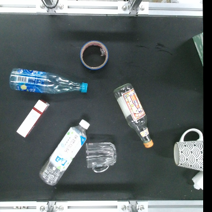
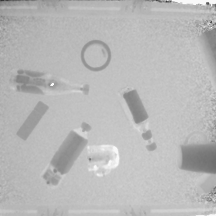
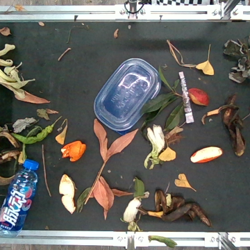
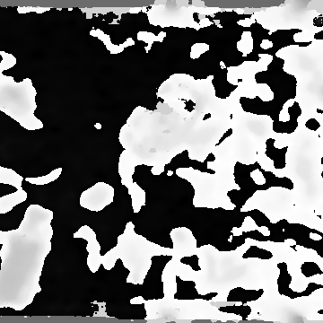

# KWG2024
A 2D grasping RGB-D dataset for kitchen waste sorting scenarios, as described in the following paper:

**An Efficient Generative Intelligent Multi-Objective Grasping Model for Kitchen Waste Sorting**,  
by Songyun Deng, Ruiyuan Pei, Li Zhou, Hai Qin, Wei Sun, and Qiaokang Liang,

which is used to address the issue of excessive and incorrect grasps generated by generative networks in single-attempt grasp planning of multiobjects for kitchen waste sorting.

If you want to use this dataset or wish to refer to the baseline results published in this paper, please use the following BibTeX entry:
```
@ARTICLE{10945475,
  author={Deng, Songyun and Pei, Ruiyuan and Zhou, Li and Qin, Hai and Sun, Wei and Liang, Qiaokang},
  journal={IEEE Transactions on Instrumentation and Measurement}, 
  title={An Efficient Generative Intelligent Multiobjective Grasping Model for Kitchen Waste Sorting}, 
  year={2025},
  volume={74},
  pages={1-10},
  keywords={Grasping;Belts;Robots;Sorting;Annotations;Computational modeling;Accuracy;Planning;Robot kinematics;Object detection;Embedded AI;generative network;kitchen waste sorting;multiobject grasping;RGB-D dataset},
  doi={10.1109/TIM.2025.3555698}}
```

# Introduction
This dataset comprises original images captured with Kinect V2 and Realsense D455 cameras. The data includes 10 common types of sorting objects in kitchen waste scenarios, namely Plastic Bottle, Plastic Box, Paper Box, Paper Cup, Metal Bottle, Glass Bottle, Ceramic Cup, Wooden Block, Foam, and Others. This dataset include 2,167 RGB-D images taken against a relatively clean background and 949 RGB-D images against a dirty and complex background. The former are captured with the Kinect V2 camera, while the latter with the Realsense D455 camera. Moreover, calibration is performed on both cameras, utilizing the derived parameters to reduce image distortion and to align the RGB images with the depth images. Besides, the dataset comprises 2,721 assisted annotations and 18,231 human-experience annotated grasps based on the annotation standard of the [Cornell dataset](http://pr.cs.cornell.edu/grasping/rect_data/data.php).


# Annotation
Our annotation tool used is adapted from the [grasp-rectangle-labelling tool](https://github.com/ulaval-damas/grasp-rectangle-labelling). Our tool can simultaneously annotate the standard annotations of the Cornell dataset and our customized assisted annotations.

In addition, in our paper, there are 10 categories of objects, and in this dataset, there are 13 labeled targets, named with serial numbers 1 to 13. Among them, 10 to 13 are all classified as the 10th category: Others.
# License
Shield: [![CC BY 4.0][cc-by-shield]][cc-by]

This work is licensed under a
[Creative Commons Attribution 4.0 International License][cc-by].

[![CC BY 4.0][cc-by-image]][cc-by]

[cc-by]: http://creativecommons.org/licenses/by/4.0/
[cc-by-image]: https://i.creativecommons.org/l/by/4.0/88x31.png
[cc-by-shield]: https://img.shields.io/badge/License-CC%20BY%204.0-lightgrey.svg

